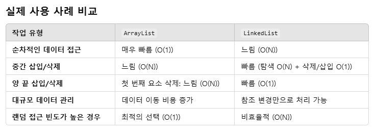

# LinkedList

## 요소 가져오기
1. 원하는 인덱스의 요소를 가져오기 - O(N)
- 인덱스에 해당하는 노드를 찾아오는 과정에서 순회하므로 O(N)의 복잡도를 가진다

## 요소 추가
1. 배열의 처음이나 마지막에 추가하는 경우 - O(1)
- first 변수로 처음 노드를 O(1)으로 가져온 후 새로운 노드 생성 후 first.prev로 연결만 시켜주면 되므로 O(1)의 복잡도이다
- last 변수로 마지막 노드를 O(1)으로 가져온 후 새로운 노드 생성 후 last.next로 연결만 시켜주면 되므로 O(1)의 복잡도이다

2. 지정된 인덱스에 추가하는 경우 - O(N)
- 인덱스에 위치한 노드를 가져오는데 O(N), 인덱스가 마지막일 경우 O(1)이다

## 요소 삭제
1. 배열의 첫번째나 마지막 요소를 삭제하는 경우 - O(1)
- first나 last 변수로 첫번째나 마지막 노드를 가져온 후 연결을 끊어준다 O(1)

2. 배열의 중간에 요소를 삭제하는 경우 - O(N)
- 특정 인덱스로 노드를 삭제시킬 부분을 찾는데 O(N), 삭제하는데 O(1)이므로 결과적으로 O(N)이다

## ArrayList와의 차이
1. ArrayList와 달리 인덱스를 알고 있어도 해당 노드를 찾아오는데 순회를 해야하기 때문에 요소를 가져올 때 느리다
2. 노드간의 연결을 끊어주어 요소를 삭제시키는 개념이라 나머지 요소들은 건드리지 않고 추가, 삭제를 할 수 있다

## 궁금점
그러면 사실 LinkedList의 경우 index에 해당하는 node를 찾기 위해 O(N), 삭제하는데 O(1) 그리고 ArrayList의 경우 index에 해당하는 요소를 찾는데 O(1), 삭제하고 남은 배열을 앞당기는데 O(N) 이러면 결국 비슷한거아닌가?

-> GPT의 답변
 표면적으로 보면, LinkedList와 ArrayList 모두 탐색 + 삭제 작업에서 최악의 경우 **O(N)**의 시간 복잡도를 가지기 때문에 비슷해 보일 수 있습니다. 그러나 실제로는 데이터의 분포, 접근 패턴, 그리고 삭제 작업의 성격에 따라 성능 차이가 발생합니다.

 성능 차이가 나는 이유
1. 데이터 크기와 연산 특성
   - ArrayList는 작은 크기의 데이터에서 탐색과 삭제 모두 더 빠릅니다.
   → 탐색이 O(1)이므로 전체 성능이 일반적으로 더 나은 경향이 있습니다.

   - LinkedList는 삽입/삭제가 빈번한 대규모 데이터에서, 특히 중간 위치나 양 끝에서 데이터를 추가/삭제할 때 성능이 더 나을 수 있습니다.
   → 노드 참조 변경만으로 작업을 수행하므로 O(1) 삭제가 가능한 것이 주요 장점입니다.

   
2. 데이터 구조의 물리적 차이
   - ArrayList는 연속된 메모리를 사용하므로, 삭제 후 데이터를 이동하는 작업이 비싼 비용을 초래합니다.
   LinkedList는 각 노드가 분리되어 있으므로 데이터를 이동할 필요가 없으며, 참조만 변경하면 됩니다. 이 구조적 차이는 대규모 데이터에서 큰 영향을 미칠 수 있습니다.

실제 활용예시  

